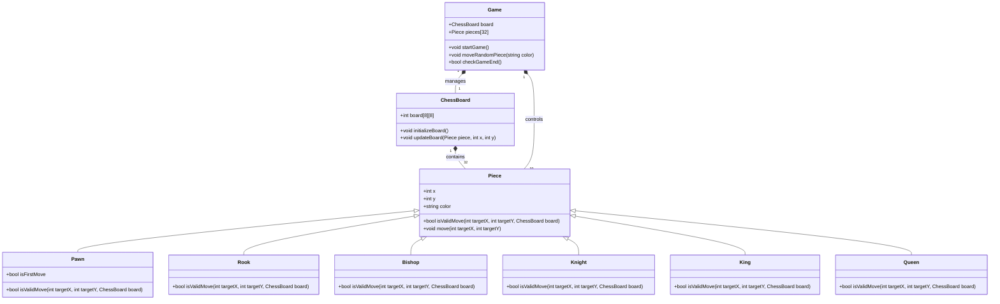

```mermaid
classDiagram
    class ChessBoard {
        +int board[8][8]
        +void initializeBoard()
        +void updateBoard(Piece piece, int x, int y)
    }

    class Piece {
        +int x
        +int y
        +string color
        +bool isValidMove(int targetX, int targetY, ChessBoard board)
        +void move(int targetX, int targetY)
    }

    class Pawn {
        +bool isFirstMove
        +bool isValidMove(int targetX, int targetY, ChessBoard board)
    }

    class Rook {
        +bool isValidMove(int targetX, int targetY, ChessBoard board)
    }

    class Bishop {
        +bool isValidMove(int targetX, int targetY, ChessBoard board)
    }

    class Knight {
        +bool isValidMove(int targetX, int targetY, ChessBoard board)
    }

    class King {
        +bool isValidMove(int targetX, int targetY, ChessBoard board)
    }

    class Queen {
        +bool isValidMove(int targetX, int targetY, ChessBoard board)
    }

    class Game {
        +ChessBoard board
        +Piece pieces[32]
        +void startGame()
        +void moveRandomPiece(string color)
        +bool checkGameEnd()
    }

    ChessBoard "1" *-- "32" Piece : contains
    Piece <|-- Pawn
    Piece <|-- Rook
    Piece <|-- Bishop
    Piece <|-- Knight
    Piece <|-- King
    Piece <|-- Queen
    Game "1" *-- "1" ChessBoard : manages
    Game "1" *-- "32" Piece : controls
```